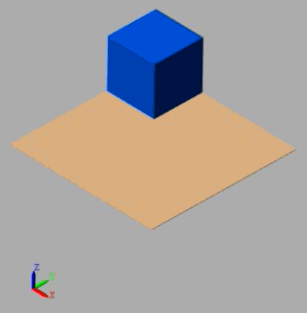
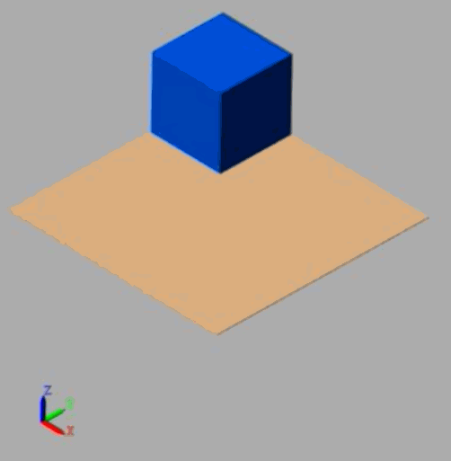

# tutorials / impedance-control

This repository contains helpful information to learn the fundamentals of impedance control. 

## 1. Overview 
__*What is mechanical impedance?*__
* _One definition_ : **A force or torque generated as a result of external motion perturbations**
* Ankle mechanical impedance can be described as a 2nd order linear system
  * Descibed as a function of the system's _inertia_, _damping_, and _stiffness_
  > Z(s) = m(s)2 + b(s) + k
  * Divided into ___intrinsic___ (joint/tendon properies) and ___extrinsic___ ankle impedance (non-linear muscle contraction)
* Mechanical impedance is the inverse of admittance
  > Z(s) = Y(s) -1 

__*When is impedance control used in robotics?*__ 
* Impedance control is useful in any situation where you have a robot interacting with a human and/or unknown enviroment
  * For example, impedance control of a ankle-foot prothesis will allow for appropriate compliance during the gait cycle (i.e. heel strike - toe off) and be able to account for uneven floor profiles.
  * Other applications: Physical interaction between humans and robots, multi-robot/multi-limb robots, collision avoidance, automotive assembly, food packaging, hazardous material packaging, etc 

## 2. Simulation Results 
### 1DOF control of mass/spring/damper system

  Original System   |  Impedance Controlled  |
------------------- | -----------------------| 
  |      |

## 3. Helpful links 
<https://www.mathworks.com/matlabcentral/fileexchange/57853-impedance-control-for-a-2-link-robot-arm-user-interactive>
