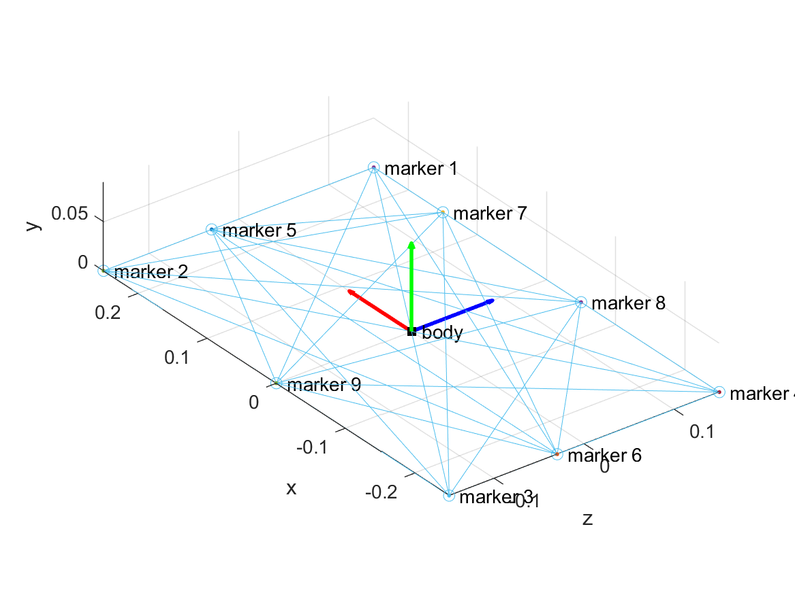
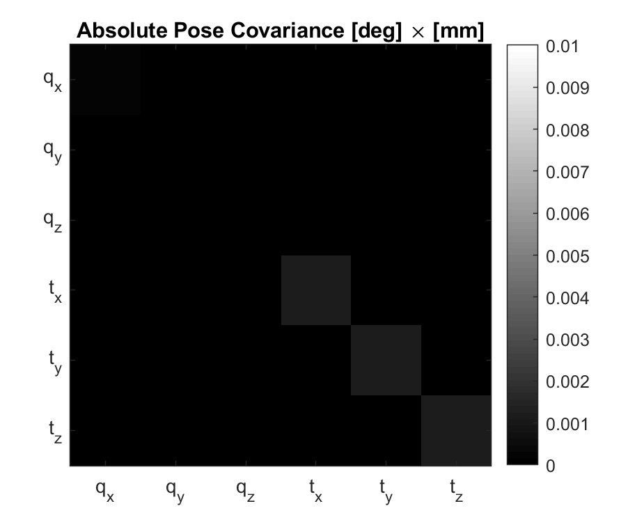
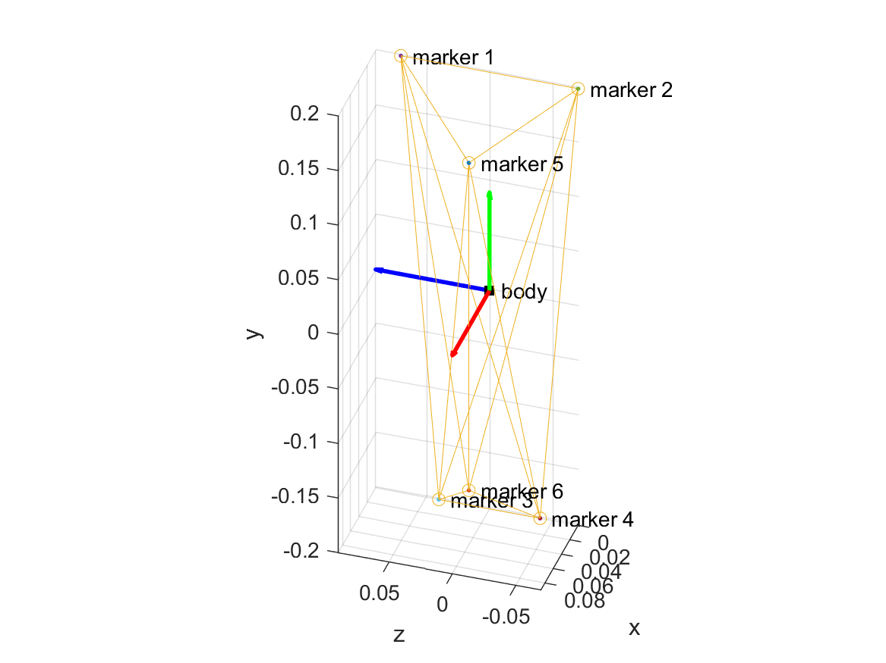
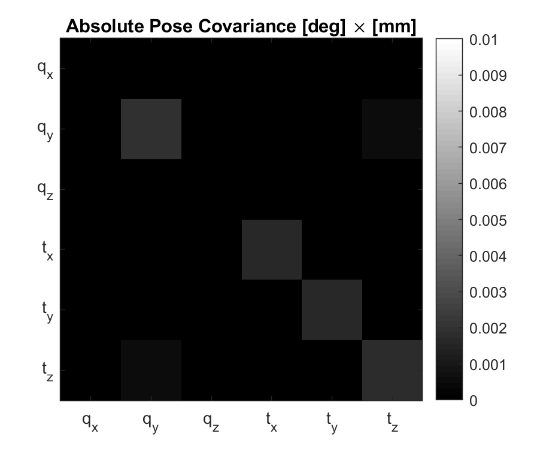
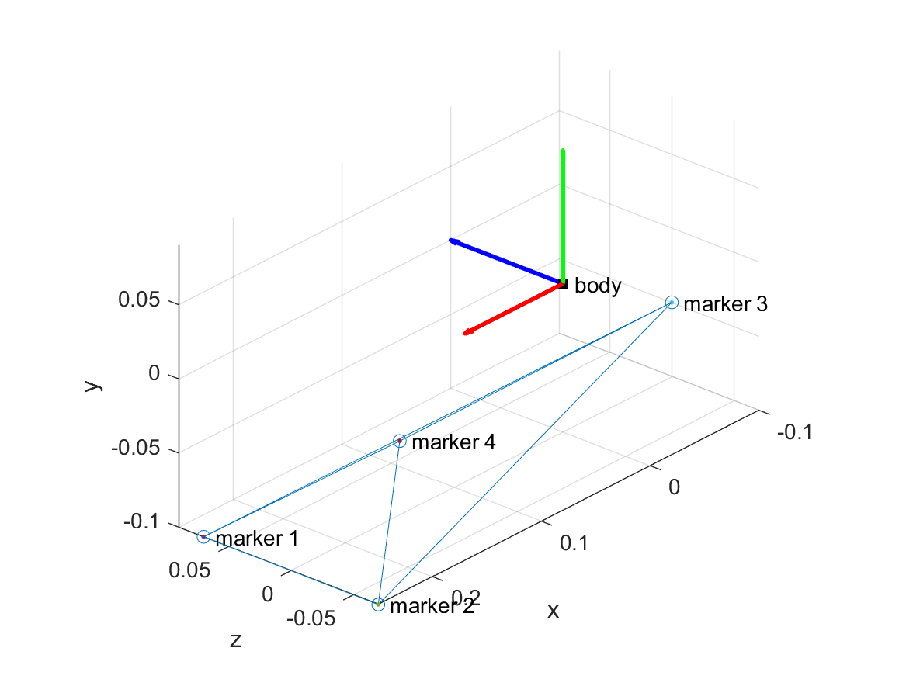
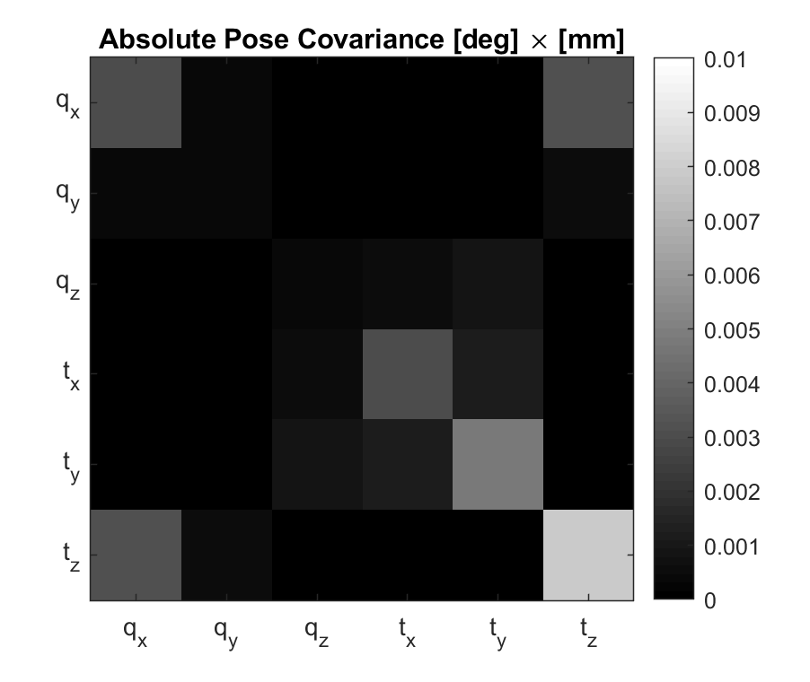

# mocap-noise-model

A model of the noise distribution can help system identification algorithms, in particular the Expectation-Maximization and Extended Kalman Filter
Modeling the noise is particuarly importatnt when the derivatives of the body pose are numerically calculated - because noise levels are acentuated.

In this script, a Gaussian noise on the marker translation is assumed to be independent between samples ad other markers.
Then, the body pose and the covariance of the body pose noise is calcuated numerically.

## How To Use

Define the body markers as the `r` variable.
Define the nominal body pose as `trans` and `quat`.
Define the marker translation noise covariance in `markerTransCov`.
The `qCov` and `transCov` are the body pose covariances.

## Results

 - The body pose noise depends on the distribution of the markers around the body, with higher angle noise along directions of narrow marker distributions
 - The translational noise of the body can be higher than the marker translational noise if the origin of the body is far from the centroid.
 - `qCov` is calculated in the body frame, so it does not depend of the body pose.
 - There is minor covariance between channels
 - Assuming `markerTransCov` equal to 0.1^2 mm^2, the 95% confidence level (1.96 std) of the bodies were

| Body | Angular [deg] | Translation [mm] |
| -- | -- | -- |
| Plate | [0.028, 0.015, 0.018]^T | [0.065, 0.065, 0.065]^T |
| Shank | [0.024, 0.088, 0.025]^T | [0.081, 0.080, 0.084]^T |
| Foot | [0.108, 0.040, 0.039]^T | [0.109, 0.136, 0.172]^T |

 - The covariances between angular and translational noise for each body were

 | Body | Marker Positioning | Absolute Noise Covariance |
| -- | -- | -- |
| Plate |  |  |
| Shank |  |  |
| Foot |  | [  |