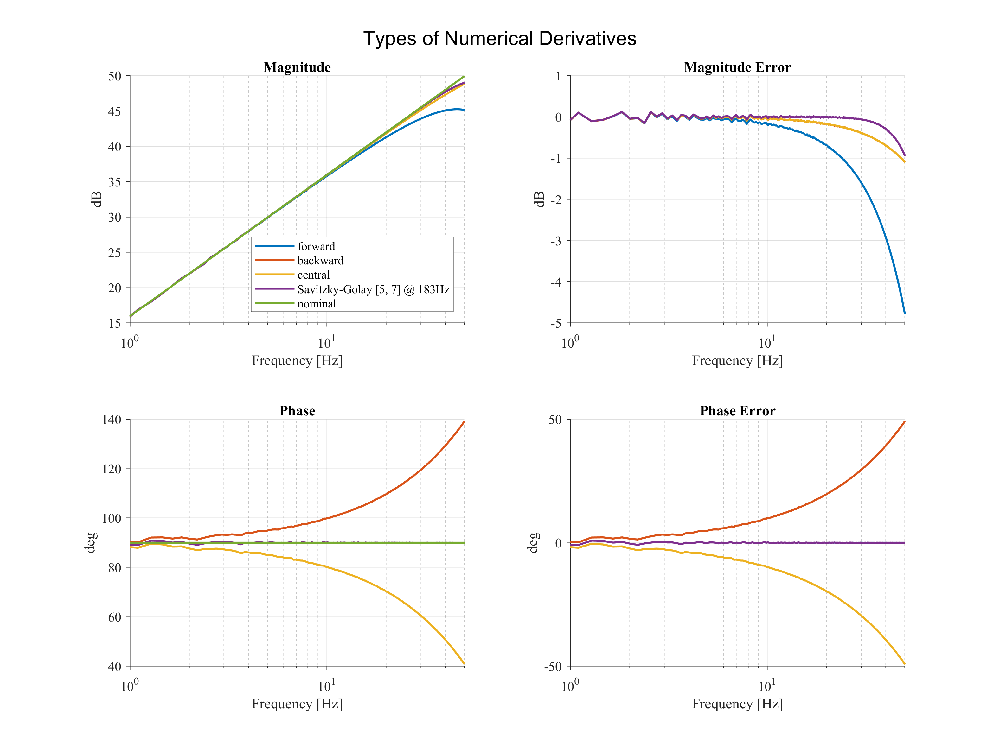

# Numerical Derivatives

Forward derivative: sample ahead minus sample now
Backward derivative: sample now minus sample behind
Central derivative: sample ahead minus sample behind
Savitzky Golay derivative: Polynomial of order N around a window of W samples around sample now

Forward and backward has low gain error, but large phase error.
Central does not have phase error, but considerable gain error.
Savitzky Golay does not have phase error and low gain error. 
In addition, noise can be reduced due to its LP behavior in high-frequencies.

